# 1 kb 6T SRAM

Schematic level design and simulation of a 1 kb SRAM built from a standard 6T bitcell and full peripheral circuitry (precharge, decoders, column muxing, write driver, sense amplifier). Implemented in Cadence Virtuoso (180 nm PDK), with simulations validating each block and the integrated memory.

---

## At a glance

| Item | Value |
|---|---|
| Memory type | 6T SRAM |
| Capacity | 1 kb |
| Organization | 32 rows x 32 columns |
| I/O width | 1 bit (column selected through muxing) |
| Technology | 180 nm PDK |
| Design level | Schematic, transistor level blocks and hierarchical integration |
| Tool | Cadence Virtuoso |
| Documentation assets | `docs/6T_SRAM.pdf`, `docs/figures/*.png` |

---

## Contents

- [Repository structure](#repository-structure)
- [Top level architecture](#top-level-architecture)
- [SRAM access cycle](#sram-access-cycle)
- [Peripheral circuits](#peripheral-circuits)
  - [Bitline precharge and equalization](#bitline-precharge-and-equalization)
  - [Write driver](#write-driver)
  - [Sense amplifier](#sense-amplifier)
  - [Row decoder and wordline driving](#row-decoder-and-wordline-driving)
  - [Column decoder and column mux](#column-decoder-and-column-mux)
- [1 bit SRAM slice](#1-bit-sram-slice)
- [Full SRAM read and write](#full-sram-read-and-write)
- [Cadence library navigation](#cadence-library-navigation)
- [Rebuilding the presentation (optional)](#rebuilding-the-presentation-optional)

---

## Repository structure

This repo commits only the Cadence library root `sram/` plus documentation under `docs/`.

**Key files**
- `sram/` : Cadence Virtuoso library root (schematics, symbols, benches, simulation states)
- `docs/6T_SRAM.pdf` : source presentation
- `docs/figures/` : exported schematics and waveform plots embedded below

---

## Top level architecture

### 1 kb array overview

- Capacity: **1 kb**
- Organization: **32 rows x 32 columns**
- Storage: **6T SRAM bitcell array**
- Shared global periphery: precharge, write driver, sense amp
- Address selection: row decoder selects one wordline, column decoder plus mux selects one BL and BLB pair to connect to the global bitlines

### Addressing and control

Top level is documented as a **1 bit I/O** datapath:

- `ADDR[9:0]`
  - lower bits select the row via row decoder and wordlines
  - upper bits select the column via column decoder and column mux path
- `DIN` data input (write)
- `DOUT` data output (read)
- Control signals (names may vary by symbol and benches):
  - `PR` precharge enable for BL and BLB
  - `WE` write enable for write driver
  - `SE` or `SA_EN` sense amplifier enable

### Top level figures

  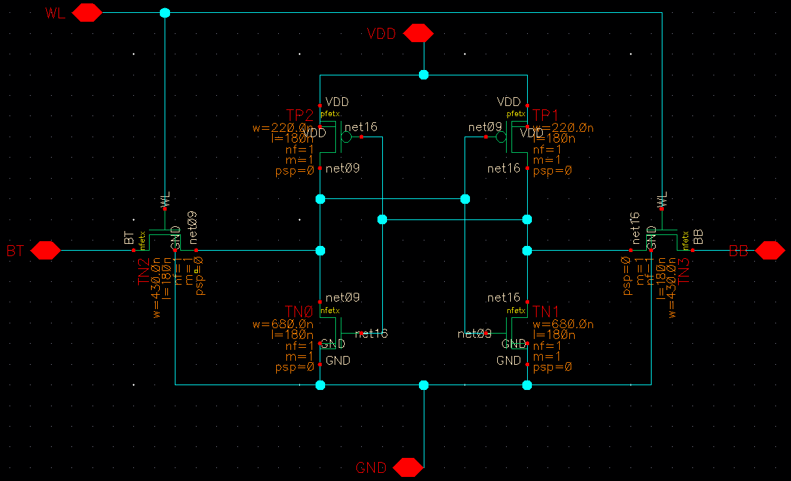

  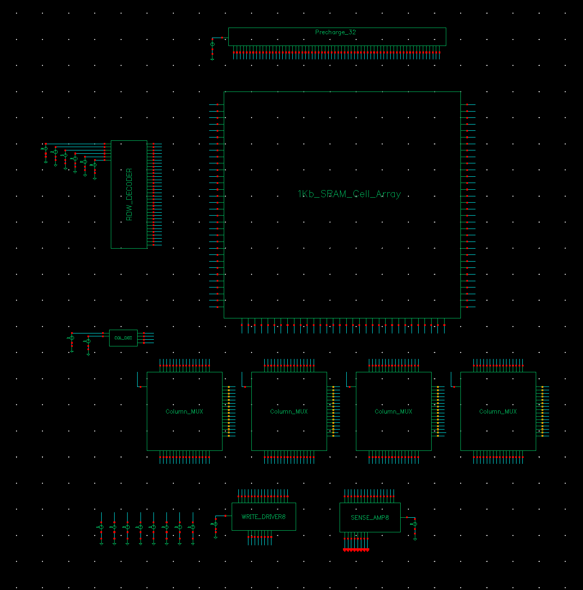

  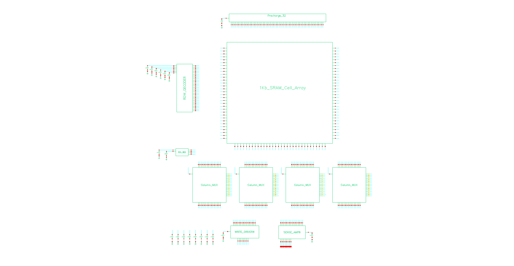

---

## SRAM access cycle

SRAM operation is built around controlling the bitlines and wordlines in a safe sequence. The two most important shared analog nodes are the differential bitlines **BL** and **BLB**. They are long, highly capacitive nets because they run across many cells in a column, so the periphery is designed to:

- start every cycle from a well defined bitline state (precharge and equalize)
- create a controlled differential on BL and BLB during read (cell discharges one side slightly)
- drive a strong differential on BL and BLB during write (write driver overwrites the cell)
- avoid contention (disable write driver during read, disable sense amp during write)

A typical cycle uses these phases:

### Read sequence (conceptual)

1. **Precharge phase**
   - Assert `PR` to charge BL and BLB to VDD and equalize them.
2. **Address decode**
   - Apply `ADDR`, row decoder selects one wordline, column decoder selects one column path.
3. **Develop differential**
   - Deassert `PR` so bitlines float.
   - Assert the selected `WL`.
   - The stored value causes one bitline to discharge slightly through the cell pulldown path.
4. **Sense**
   - Assert `SE` to enable the sense amplifier.
   - Sense amp regenerates the small BL/BLB differential to a full swing output.
5. **Restore**
   - Deassert `WL` and `SE`.
   - Return to precharge for the next access.

### Write sequence (conceptual)

1. **Precharge phase**
   - Often present between cycles to reset the bitlines, but must be disabled before actively driving the bitlines.
2. **Address decode**
   - Apply `ADDR`, select row and column.
3. **Drive bitlines**
   - Deassert `PR`.
   - Assert `WE` and apply `DIN`.
   - Write driver forces BL and BLB to complementary values.
4. **Overwrite cell**
   - Assert selected `WL`. Access devices connect BL/BLB to internal nodes Q/QB.
   - Strong bitline drive overpowers the cell feedback and flips the latch if needed.
5. **Finish**
   - Deassert `WL`, then deassert `WE`.
   - Optionally precharge again.

---

## Peripheral circuits

The periphery is what makes a large bitcell array behave like a memory. Each block below is implemented at transistor level and verified with a dedicated testbench and transient simulation.

### Bitline precharge and equalization

**Why it is needed**

Bitlines are large capacitors. If you start a read from an unknown bitline voltage, the sense decision becomes slow and unreliable. Precharge solves this by forcing both bitlines to a known initial state, then letting the cell create a small differential from that same starting point every time.

**How it is implemented**

A standard differential precharge block uses:

- **Two PMOS precharge devices**, one from VDD to BL and one from VDD to BLB.
  - When `PR` is asserted, both bitlines are pulled high.
- **One equalization device** between BL and BLB.
  - When `PR` is asserted, BL and BLB are shorted together so they start at the same voltage.
  - Equalization reduces any residual offset caused by prior reads, leakage, or asymmetric loading.

**Operation details**

- When `PR = 1`:
  - BL and BLB charge toward VDD.
  - The equalization device forces BL approximately equal to BLB.
  - This establishes a clean differential starting point.
- When `PR = 0`:
  - BL and BLB are released and become high impedance.
  - A selected cell can discharge one side slightly during read.
  - The write driver can actively force a large differential during write.

**Design considerations**

- Precharge devices must be sized to charge the worst case bitline capacitance within your target cycle time.
- Equalization should be strong enough to remove mismatch quickly, but not so strong that it creates unwanted coupling during the beginning of evaluation.
- In an array, precharge is often replicated per column or implemented as a multi bit slice such as `Precharge_32` or similar.

  
Show precharge schematic, testbench, and simulation

  

    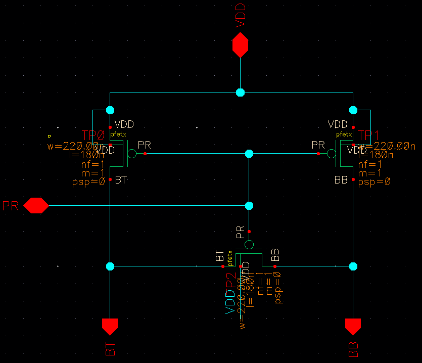
  

  

    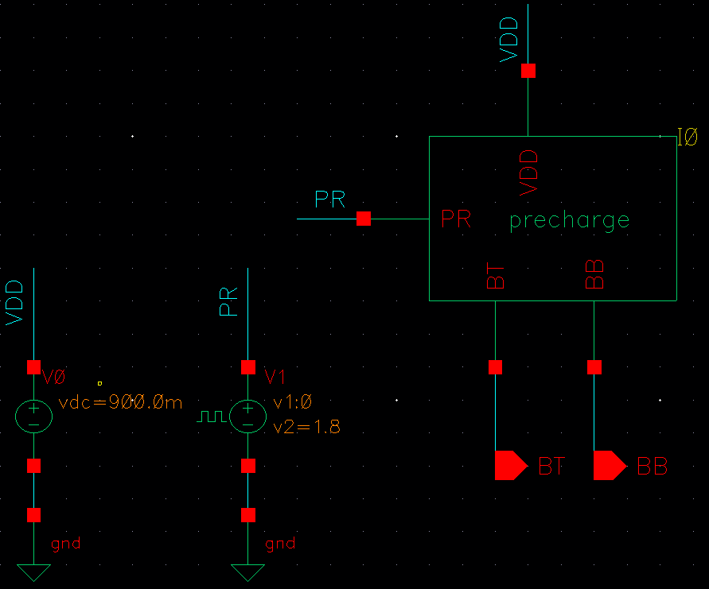
  

  

    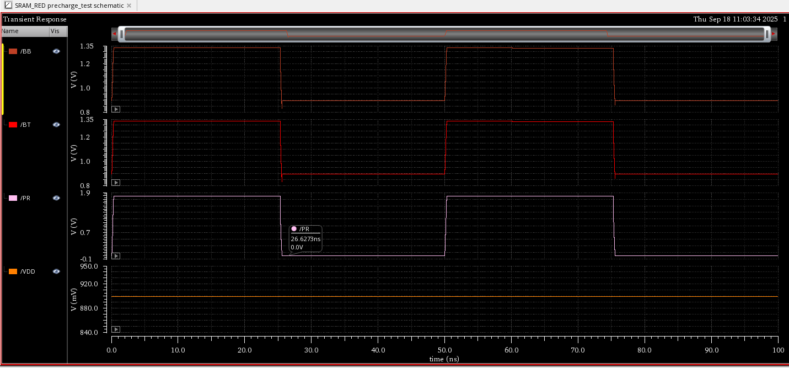
  

---

### Write driver

**Why it is needed**

Writing into a 6T cell means forcing one internal node low while allowing the opposite node to rise. The cell latch is regenerative, so the write path must be strong enough to disturb the latch through the access transistors and complete the flip within the allowed wordline pulse width.

**How it is implemented**

A practical write driver provides:

- **Complementary outputs** to BL and BLB.
- **Enable control** so the driver can be disconnected when not writing.

Common implementation styles include:
- CMOS inverter pair gated by enable devices
- transmission gate or pass device based gating
- tri-state drivers where both pull up and pull down are disabled when `WE` is low

Your implementation behavior is:
- when `WE` is asserted, the driver actively drives BL and BLB according to `DIN`
- when `WE` is deasserted, the driver does not fight precharge or read discharge

**Operation details**

- Write 1:
  - BL driven high, BLB driven low
  - with `WL = 1`, Q is forced toward 1 and QB toward 0
- Write 0:
  - BL driven low, BLB driven high
  - with `WL = 1`, Q is forced toward 0 and QB toward 1

**Design considerations**

- The driver must overcome:
  - the cell pull up PMOS for the node being raised
  - the cell feedback inverter that tries to restore the old state
  - the access transistor resistance
  - the bitline capacitance that must be charged or discharged
- During non write phases, leaving the driver connected can:
  - clamp bitlines and prevent proper precharge
  - load the bitlines and slow down differential development
  - create contention during read, increasing power and risking incorrect sensing
  This is why a clean disable function is critical.

  
Show write driver schematic, testbench, and simulation

  

    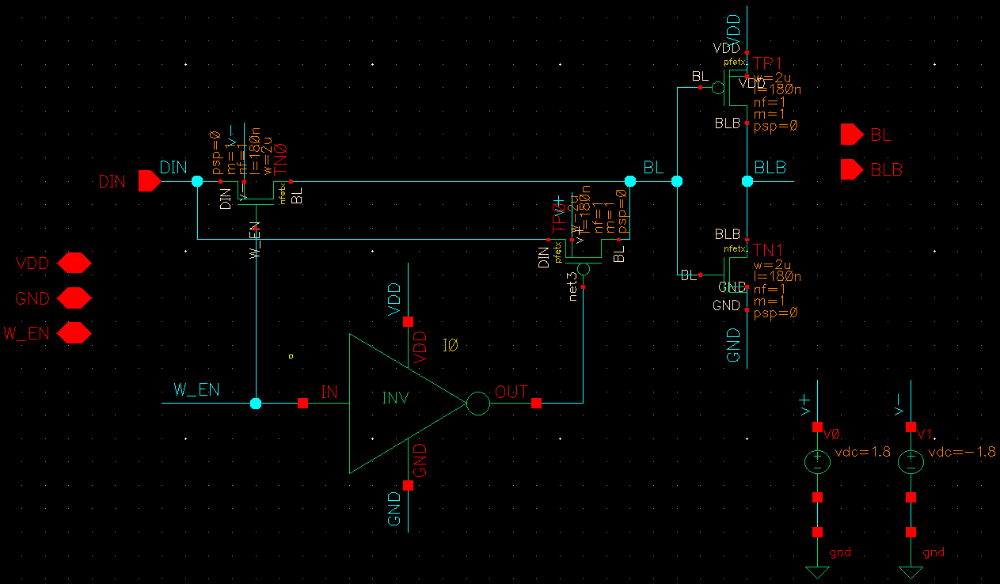
  

  

    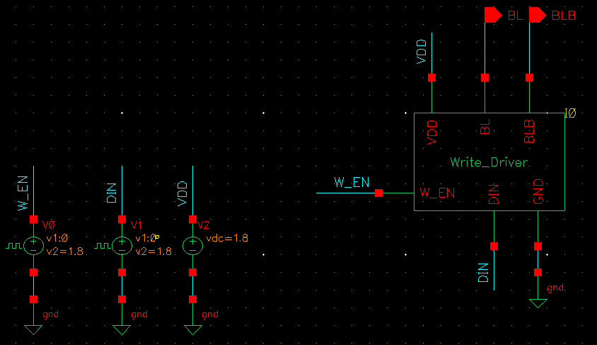
  

  

    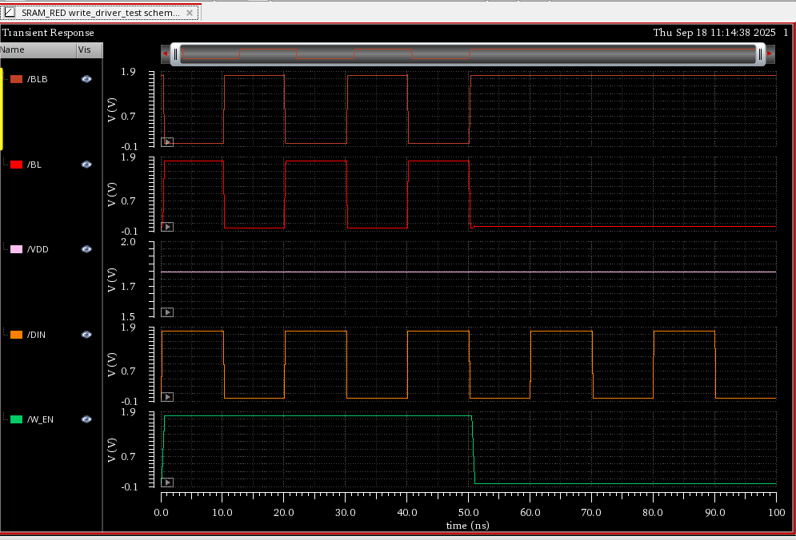
  

---

### Sense amplifier

**Why it is needed**

During read, a cell only slightly discharges one bitline because:
- bitline capacitance is large
- you want to minimize read disturb by keeping the swing small
- charging and discharging full bitline rails would be slow and power expensive

A sense amplifier converts a small BL/BLB differential into a full swing logic signal quickly.

**How it is implemented**

A common latch type sense amplifier uses:
- a cross coupled regenerative structure (positive feedback)
- an enable device or tail switch controlled by `SE` (or `SA_EN`)
- input devices connected to BL and BLB that steer the initial imbalance into the latch

When enabled, the latch amplifies the initial voltage difference and resolves into a stable digital state.

**Operation details**

1. **Prepare**
   - BL and BLB are precharged and equalized.
   - Sense amp is disabled so it does not disturb the bitlines.
2. **Create differential**
   - With `WL` asserted, the cell discharges one bitline slightly.
3. **Enable**
   - `SE` is asserted.
   - Positive feedback rapidly drives the outputs to VDD and GND based on which input was slightly lower.
4. **Latch output**
   - The resolved output is used as `DOUT` or is passed through a buffer depending on the top level integration.

**Design considerations**

- Sense enable timing matters:
  - enabling too early can amplify noise before the cell creates a reliable differential
  - enabling too late increases read latency
- Input offset and device mismatch can create a bias. Precharge equalization helps, and device sizing can reduce sensitivity.
- The sense amplifier should be isolated from bitlines when disabled to reduce loading.

  
Show sense amp schematic, testbench, and simulation

  

    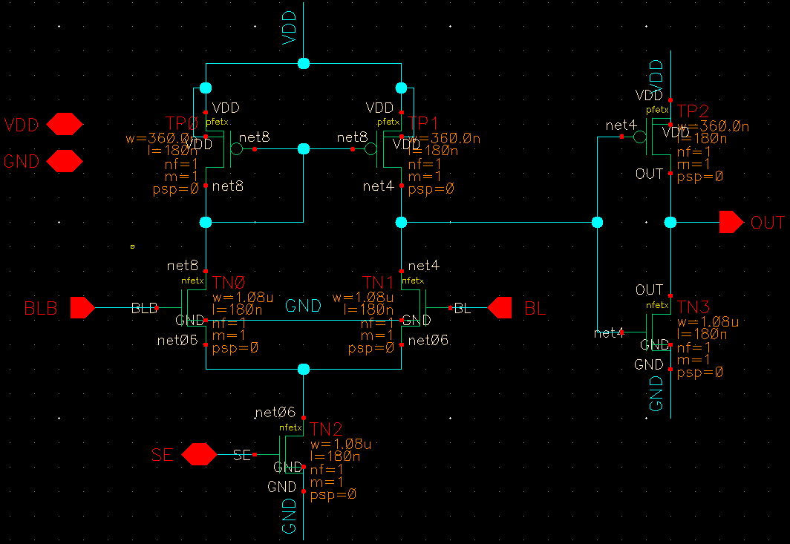
  

  

    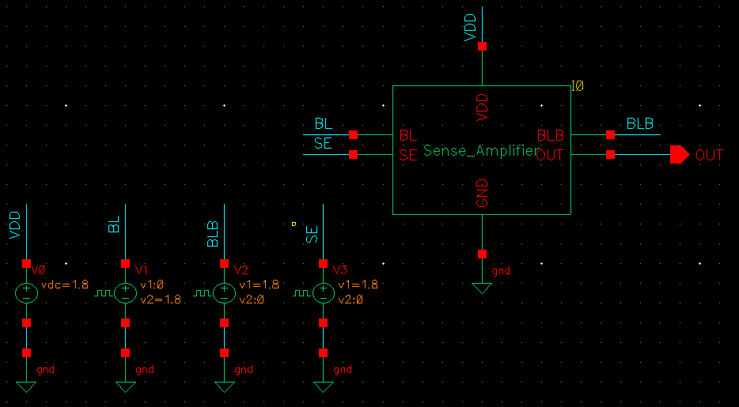
  

  

    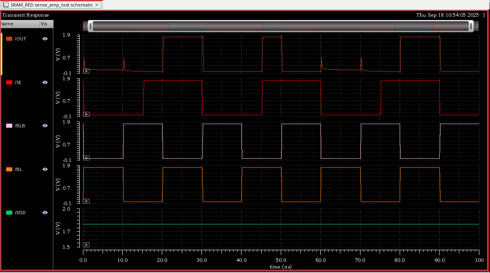
  

---

### Row decoder and wordline driving

**Why it is needed**

The row decoder selects exactly one wordline out of 32. A wordline drives the gates of all access transistors in that row, so it is a long, capacitive net and needs clean, full swing transitions.

**How it is implemented**

The decoder is built hierarchically from smaller decoders:
- 2 to 4 decoder
- 3 to 8 decoder

This approach reduces the fan in of any single gate compared to a flat 5 to 32 minterm decoder and improves speed and layout regularity.

Practical points in wordline driving:
- internal decode nodes may be buffered
- the final stage should provide enough drive for WL capacitance
- one hot behavior must be maintained across all input combinations

**Operation details**

- Apply row address bits.
- The decoder generates one hot WL.
- Only the selected WL goes high, turning on access devices for the row.
- All unselected WL remain low to isolate other rows.

  
Show row decoder schematic, testbench, and simulation

  

    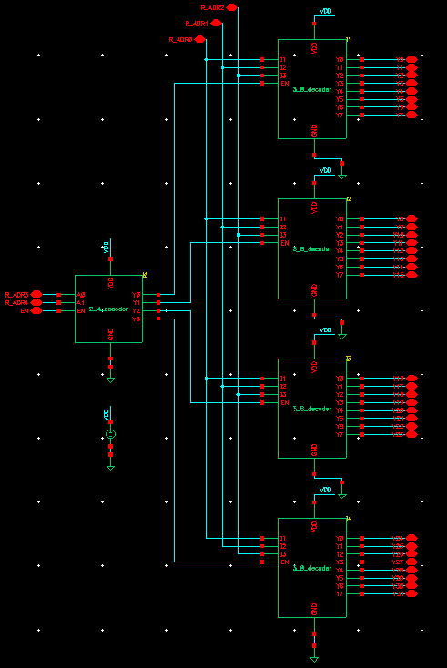
  

  

    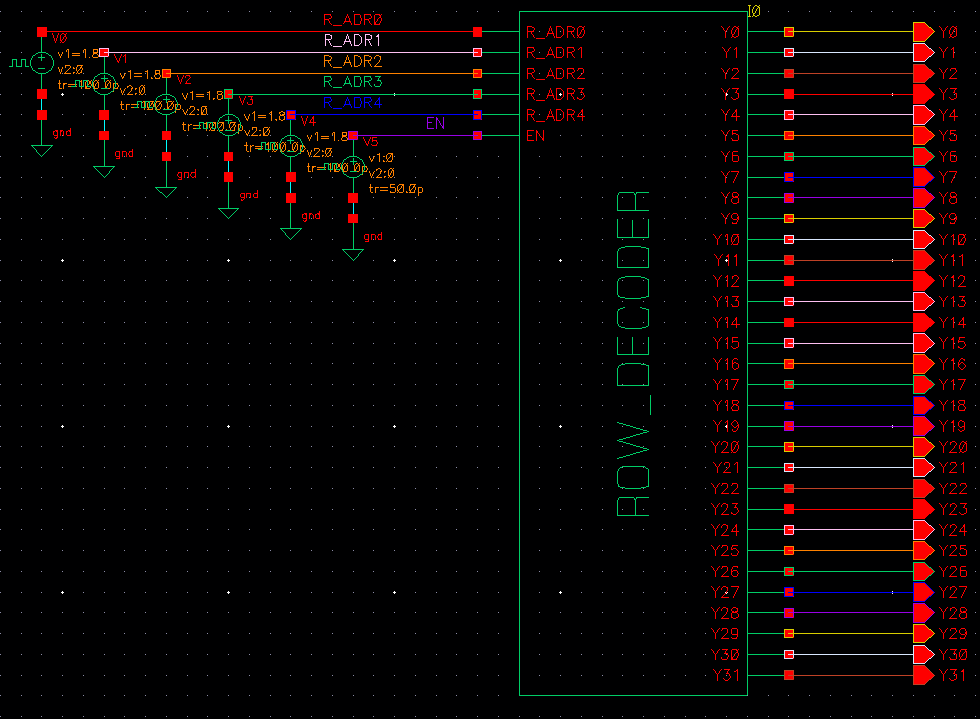
  

  

    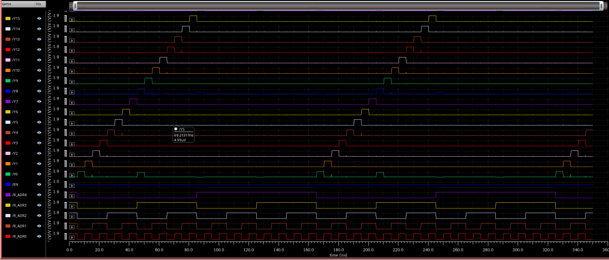
  

  
Show 2 to 4 and 3 to 8 decoder blocks with benches

  

    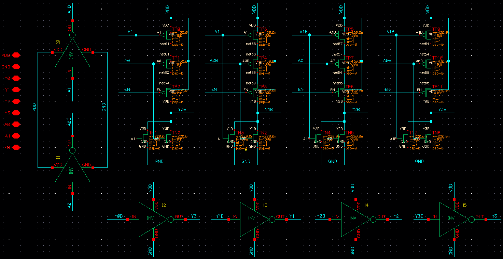
  

  

    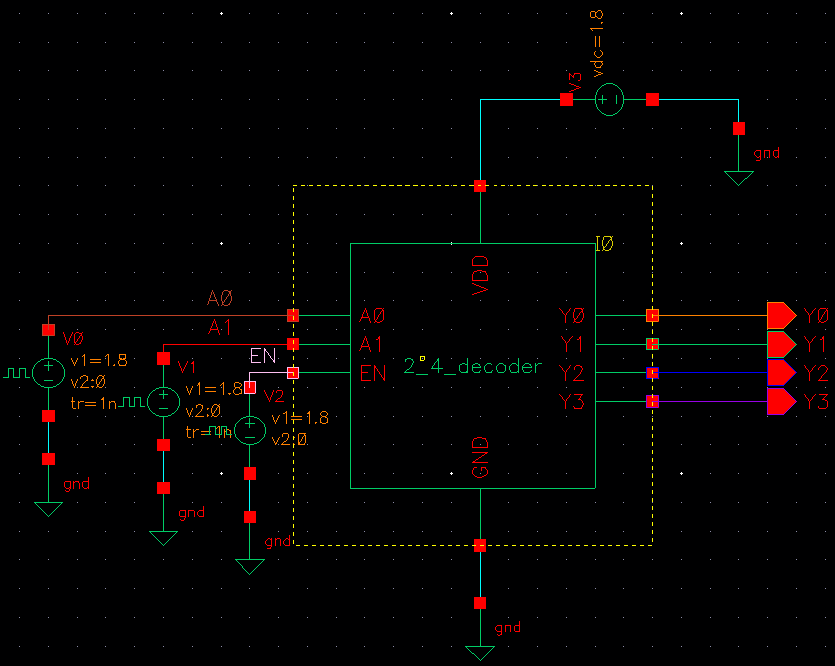
  

  

    
  

  

    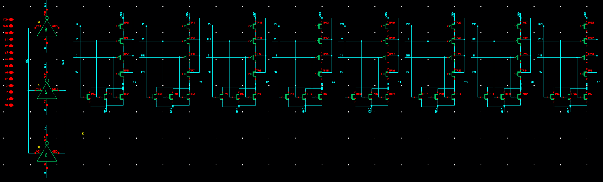
  

  

    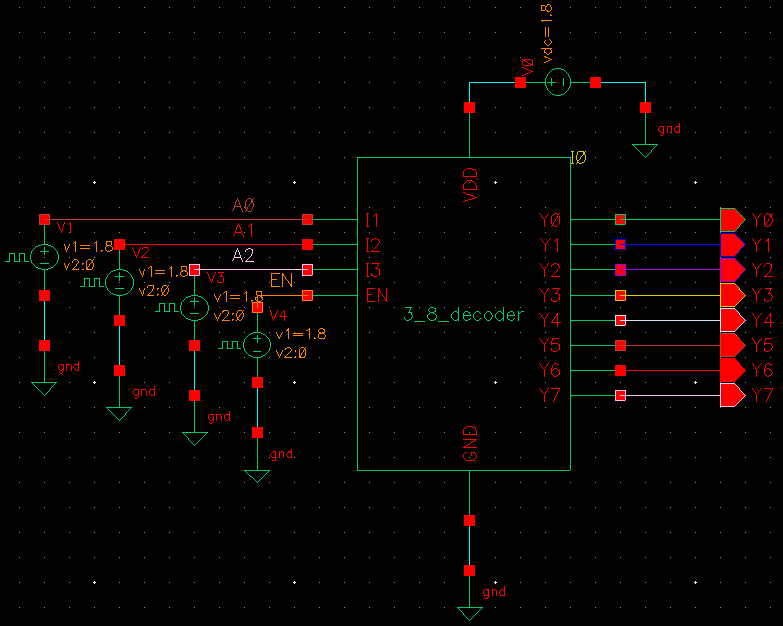
  

  

    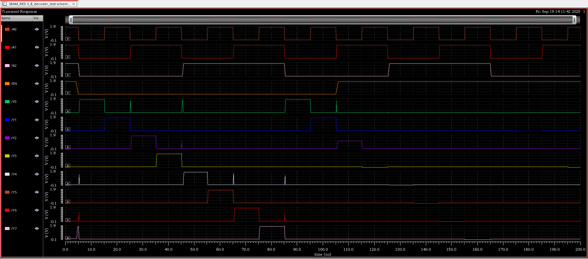
  

---

### Column decoder and column mux

**Why it is needed**

Only one column should connect to the global read and write datapath at a time. Column selection is responsible for:
- choosing which BL/BLB pair is observed by the sense amp during read
- choosing which BL/BLB pair is driven by the write driver during write

**How it is implemented**

- The column decoder generates one hot column select signals.
- The column mux is commonly implemented using pass transistors or transmission gates that connect:
  - local BL_i and BLB_i to the global BL and BLB
  - only for the selected column

**Operation details**

- When a column select is active:
  - the selected local bitline pair is connected to the global bitlines
  - all other columns remain isolated to prevent contention and reduce loading
- During write:
  - the write driver drives global BL/BLB
  - the selected mux passes that differential to the selected column
- During read:
  - the selected column’s local BL/BLB differential is passed to the global lines for sensing

**Design considerations**

- Pass devices add series resistance:
  - too much resistance slows the write and reduces the read differential at the sense amp inputs
- Ensure one hot selection:
  - if two mux paths turn on simultaneously, bitlines can short or corrupt data
- A good practice is to include timing that ensures:
  - column select is stable before enabling WL and SE

  
Show column decoder, column mux, and column mux write simulation

  

    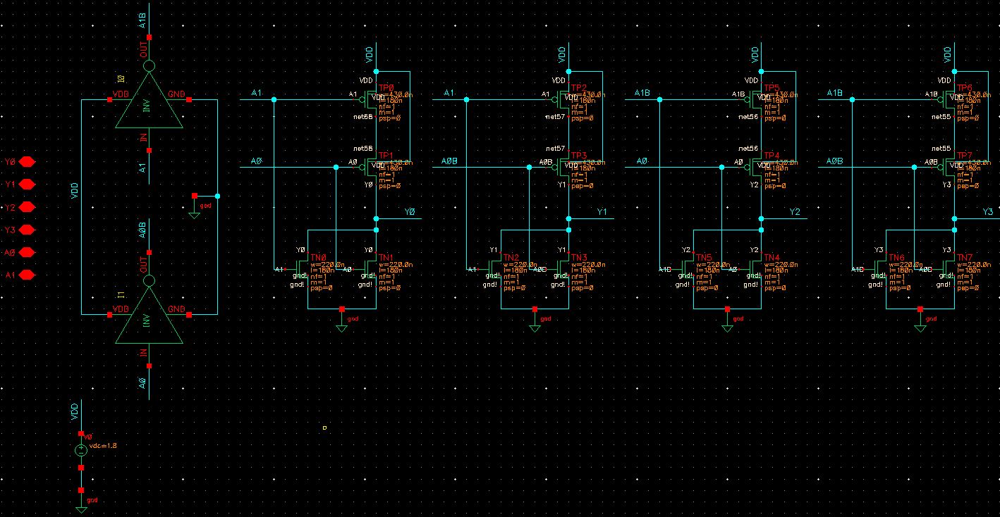
  

  

    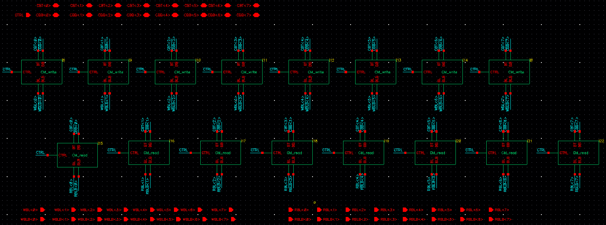
  

  

    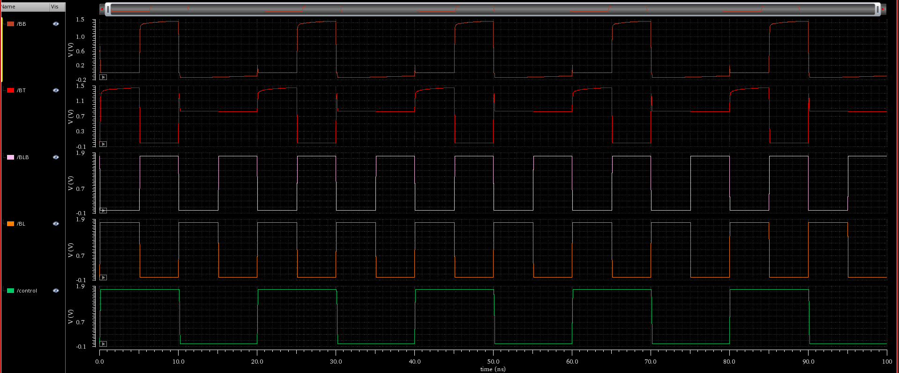
  

---

## 1 bit SRAM slice

A single cell slice is used to validate correct behavior with periphery and control sequencing before scaling to the full array. This is useful because it isolates correctness of read and write timing from large array parasitics.

  
Show 1 bit SRAM design and simulation

  

    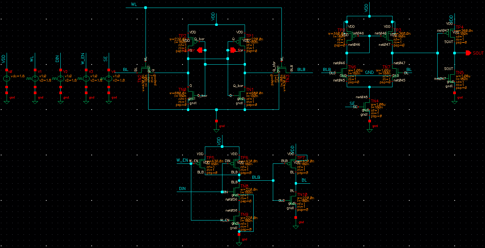
  

  

    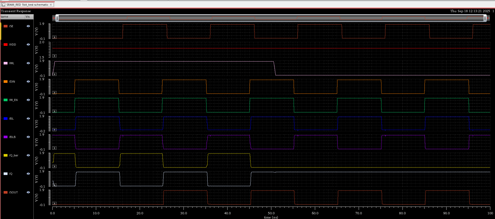
  

---

## Full SRAM read and write

### Write operation

  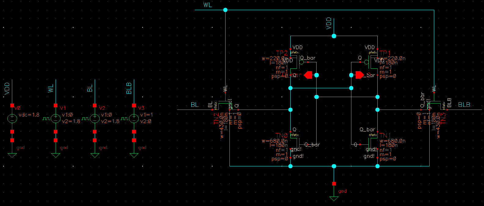

### Read operation

  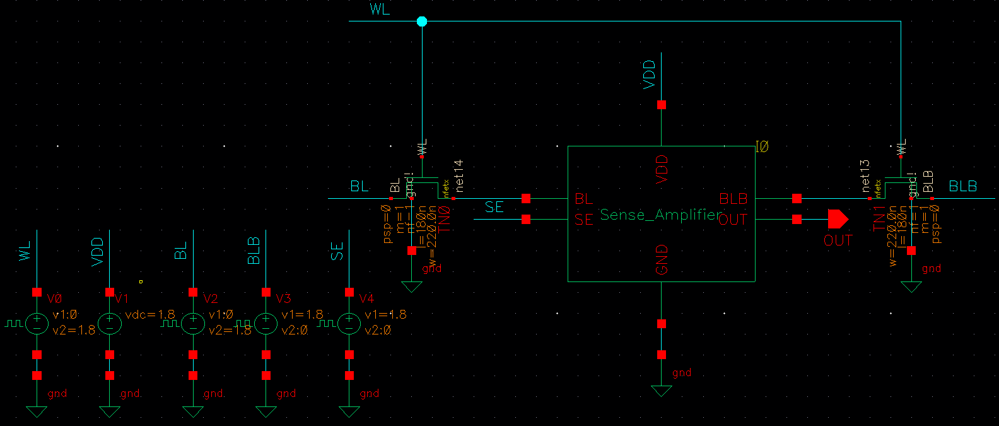

  
Show integrated simulation overview and waveforms

  

    
  

  

    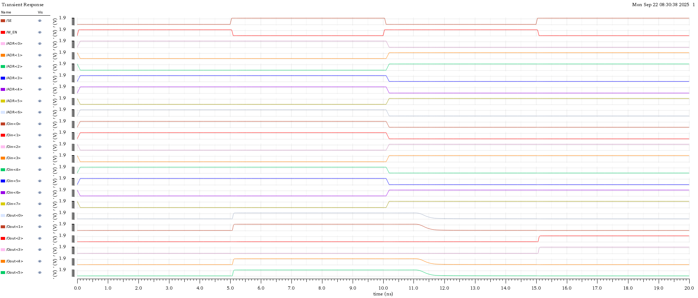
  

---

## Cadence library navigation

All design data is inside `sram/` (Cadence library root). Directory names follow Cadence export conventions and may include encoded characters such as `#2d` in place of `-`.

Typical entry points:
- Bitcell: `sram/SRAM_cell` and benches in `sram/SRAM_cell_sim`
- Precharge: `sram/precharge_ckt` plus benches in `sram/SRAM_PCH_sim`
- Write driver: `sram/write_driver` plus benches in `sram/SRAM_WD_sim`
- Sense amp: `sram/sense_amp*` plus benches in `sram/sense_amp_sim`
- Decoders: `sram/decoder`, `sram/c#2ddecoder*`
- Full integration: `sram/full_SRAM`, `sram/SRAM_full`, and benches in `sram/full_SRAM_sim`

---

